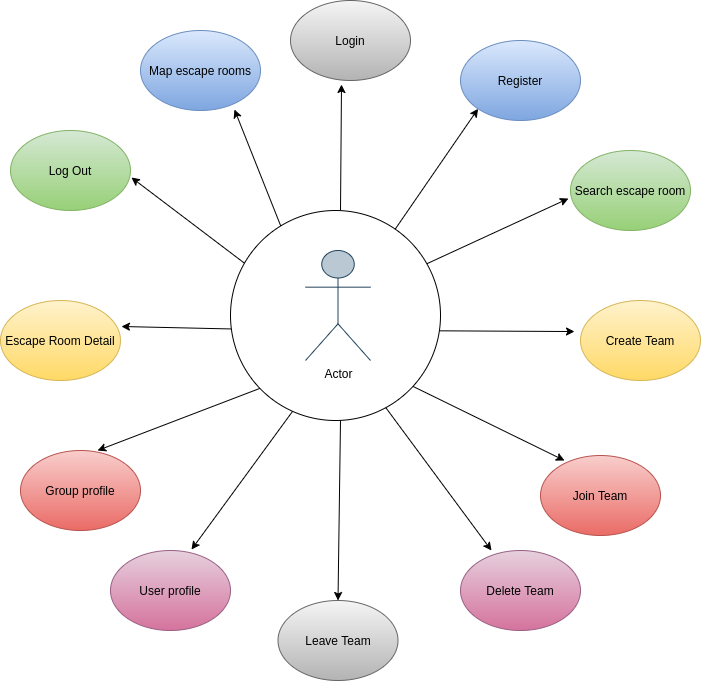
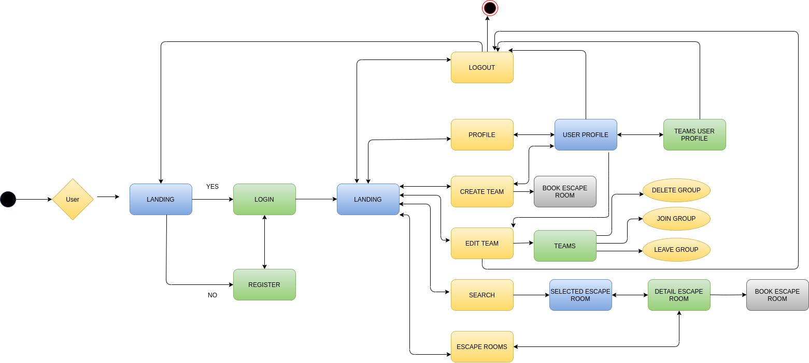
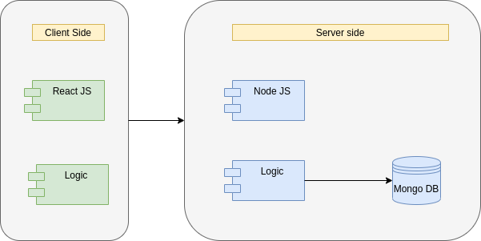
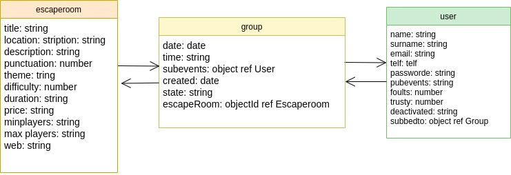
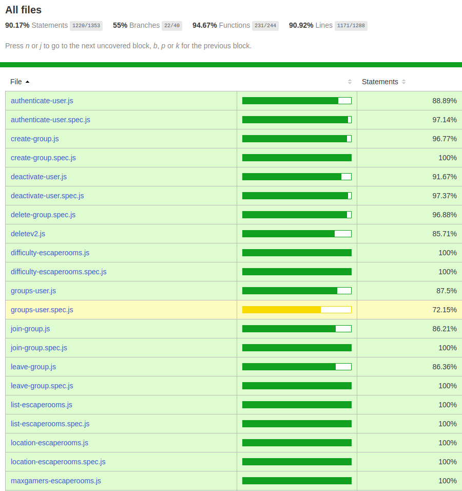

## FRIENDESCAPE

FriendEscape is a application where you will have the chance to find information about escapes rooms in Barcelona. You will find information about price, groups, duration, different themes,... You also will have the chance to create new groups in order to be able to join one escape room, if you have done a reservation and your group can't go, here you will find new friends ..., or on the other hand if you find a group that is already created you can join them. 

### FUNCTIONAL DESCRIPTION
The user should be registered on the app to acces to all the options of the app. The available functionalities are: 
* Check escape rooms
* Check locations of the escape rooms
* Acces to the reservation page of the oficial site
* Check available groups
* Create a new group
* Join one of the groups
* Check your profile
* Check your teams

## TECHNOLOGIES
JavaScript, ReactJS, Node.js, Express, MongoDB, Mongoose, SASS & BEM, Mocha/Chai

## USE CASES

## FLOW

## BLOCKS

## DATA MODEL

## COVERAGE

## TRELLO
https://trello.com/b/9w2c436o/friendescape